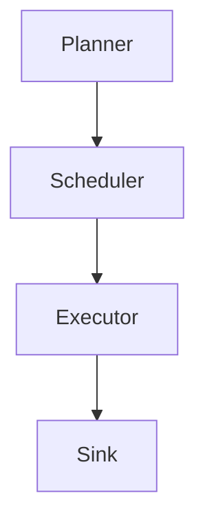

# TaskWeaver

[](https://example.com/ci)

TaskWeaver is a next-generation, extensible orchestration substrate that unifies
heterogeneous execution primitives under a single declarative control plane,
enabling teams to compose, observe and evolve their automation estate without
lock-in to any particular runtime or vendor.

## Architecture



The Planner resolves the DAG, the Scheduler assigns leases, and the Executor
drives adapters. Sinks are pluggable.

## Why TaskWeaver

- Declarative
- Extensible
- Observable
- Cloud native

## Configuration

```yaml
weaver:
  planner: default
  concurrency: 8
```

## Installation

```bash
npm install -g taskweaver
taskweaver init
```

Requires an account on the TaskWeaver Cloud control plane and an administrator
to approve the workspace before the CLI will authenticate.

## Roadmap

- Email sink (planned)
- Telegram sink (planned)

## License

Released under the MIT License.
